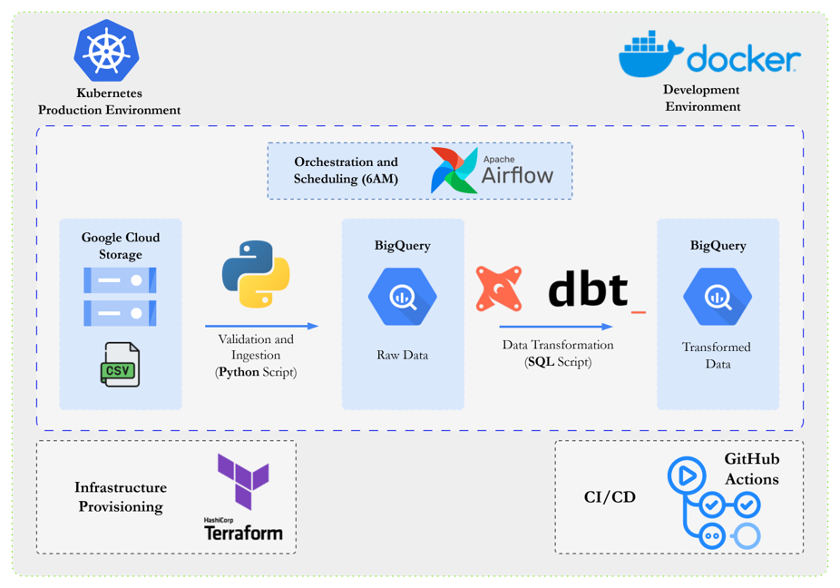

# Airflow Batch ELT Pipeline

A production-grade batch ELT pipeline built on Google Cloud Platform. Raw order data is ingested from GCS, validated, loaded into BigQuery, and transformed by dbt — all orchestrated by Apache Airflow running on GKE.

## Architecture



```
GCS (raw/orders/)
      │
      ▼
 GCS Sensor           ← waits for today's file
      │
      ▼
Great Expectations    ← validates schema and data quality
      │
      ▼
BigQuery (raw)        ← loads CSV into raw.orders
      │
      ▼
dbt staging           ← cleans and casts to stg_orders (view)
      │
      ▼
dbt marts             ← builds fct_orders fact table
```

**Infrastructure:**
- **Orchestration:** Apache Airflow 2.9.1 on GKE (KubernetesExecutor)
- **Storage:** Google Cloud Storage
- **Warehouse:** BigQuery (`raw` → `staging` → `marts`)
- **Transforms:** dbt 1.11 with BigQuery adapter
- **Validation:** Great Expectations
- **IaC:** Terraform
- **CI/CD:** GitHub Actions → Artifact Registry → GKE via Helm

## Project Structure

```
├── dags/
│   └── gcs_ingestion_dag.py      # Main DAG: sense → validate → load → transform
├── include/
│   ├── dbt/
│   │   ├── profiles.yml           # dbt profiles (dev: service-account, prod: oauth/Workload Identity)
│   │   └── orders_pipeline/
│   │       └── models/
│   │           ├── staging/       # stg_orders view — cleans raw data
│   │           └── marts/         # fct_orders table — analytics-ready fact table
│   ├── gcs/
│   │   ├── ingestion.py           # GCS download + Great Expectations validation logic
│   │   └── schemas/orders.json    # BigQuery schema for raw.orders
│   └── great_expectations/        # GX expectation suites
├── k8s/
│   ├── helm/values.yaml           # Airflow Helm chart configuration
│   └── manifests/
│       ├── postgres.yaml          # PostgreSQL StatefulSet (Airflow metadata DB)
│       └── service-account.yaml   # K8s SA with Workload Identity annotation
├── terraform/
│   └── main.tf                    # GCS, BigQuery, GKE, Artifact Registry, IAM, Secrets
├── tests/                         # pytest unit and integration tests
├── Dockerfile                     # Custom Airflow image with dbt + GX installed
└── .github/workflows/deploy.yml   # CI/CD: test → build → push → deploy
```

## DAG Schedule

The DAG runs daily at **06:00 UTC** and expects a file at:
```
gs://<bucket>/raw/orders/YYYY-MM-DD/orders.csv
```

## CI/CD Pipeline

Every push to `main`:
1. Runs pytest
2. Builds and pushes Docker image to Artifact Registry (tagged with git SHA)
3. Applies Kubernetes manifests
4. Runs Airflow DB migrations
5. Deploys via `helm upgrade --install`
6. Verifies all components are healthy

Manual trigger available via **Actions → CI/CD → Run workflow**.

## Prerequisites

### GitHub Actions Secrets

Set these in **GitHub → Settings → Secrets and variables → Actions**:

| Secret | Description |
|--------|-------------|
| `GCP_PROJECT_ID` | GCP project ID e.g. `blessing-airflow-elt` |
| `GCP_SA_KEY` | Service account JSON key (output of `terraform apply`) |
| `GKE_CLUSTER_NAME` | GKE cluster name e.g. `blessing-airflow-elt-gke` |
| `GKE_ZONE` | GKE cluster zone e.g. `us-central1-b` |

### Airflow Connection

After deployment, create the `google_cloud_default` connection manually in the Airflow UI:

**Admin → Connections → +**

| Field | Value |
|-------|-------|
| Connection Id | `google_cloud_default` |
| Connection Type | `Google Cloud` |
| Project Id | `blessing-airflow-elt` |

**Production (GKE):** Leave Keyfile Path and Keyfile JSON blank — Workload Identity handles authentication automatically.

**Local (Docker Compose):** Set Keyfile JSON to the contents of the service account key file that Terraform writes to your local machine after `terraform apply` (location defined in `terraform/main.tf` under `local_file.airflow_sa_key_file`).

## Local Development

**Prerequisites:** Docker, `gcloud` CLI, `kubectl`, `helm`

```bash
# 1. Provision GCP infrastructure (GCS bucket and BigQuery datasets are required even locally)
cd terraform && terraform apply && cd ..

# 2. Start Airflow locally
docker compose up

# 3. Upload sample data to GCS
gsutil cp include/sample_data/orders.csv \
  gs://blessing-airflow-elt-airflow-data/raw/orders/$(date +%Y-%m-%d)/orders.csv

# 4. Trigger the DAG from the Airflow UI at http://localhost:8080  (admin / admin)

# Run tests
pip install uv && uv export --no-hashes > /tmp/req.txt && pip install -r /tmp/req.txt
pytest tests/ -v

# Run dbt locally (requires GOOGLE_APPLICATION_CREDENTIALS set)
dbt run --profiles-dir include/dbt --project-dir include/dbt/orders_pipeline --target dev
```

## Deploy to GCP

```bash
# 1. Provision infrastructure
cd terraform && terraform apply

# 2. Push to main to trigger CI/CD
git push origin main

# 3. Get the Airflow UI URL after deployment
kubectl get svc -n airflow airflow-webserver
# Open http://<EXTERNAL-IP>:8080  (admin / admin)
```

## Triggering the Pipeline

Once deployed, upload today's orders CSV to GCS to trigger the DAG:

```bash
gsutil cp include/sample_data/orders.csv \
  gs://blessing-airflow-elt-airflow-data/raw/orders/$(date +%Y-%m-%d)/orders.csv
```

Then trigger the DAG manually from the Airflow UI (**Actions → Trigger DAG**) or wait for the scheduled run at 07:00 WAT.

## Key Design Decisions

- **KubernetesExecutor** — each task runs in an isolated pod, no worker fleet to manage
- **Workload Identity** — pods authenticate to GCP without any credentials files
- **External PostgreSQL** — custom StatefulSet instead of the bundled Bitnami chart for reliability
- **dbt target/logs redirected to `/tmp`** — image filesystem is read-only; writable paths go to ephemeral pod storage
- **Great Expectations temp dir copy** — same reason; GX config is copied to `/tmp` at runtime

## Tech Stack

| Layer | Technology |
|-------|-----------|
| Orchestration | Apache Airflow 2.9.1 |
| Compute | Google Kubernetes Engine |
| Storage | Google Cloud Storage |
| Warehouse | BigQuery |
| Transforms | dbt 1.11 + dbt-bigquery |
| Validation | Great Expectations |
| IaC | Terraform |
| CI/CD | GitHub Actions + Helm |
| Container Registry | Artifact Registry |